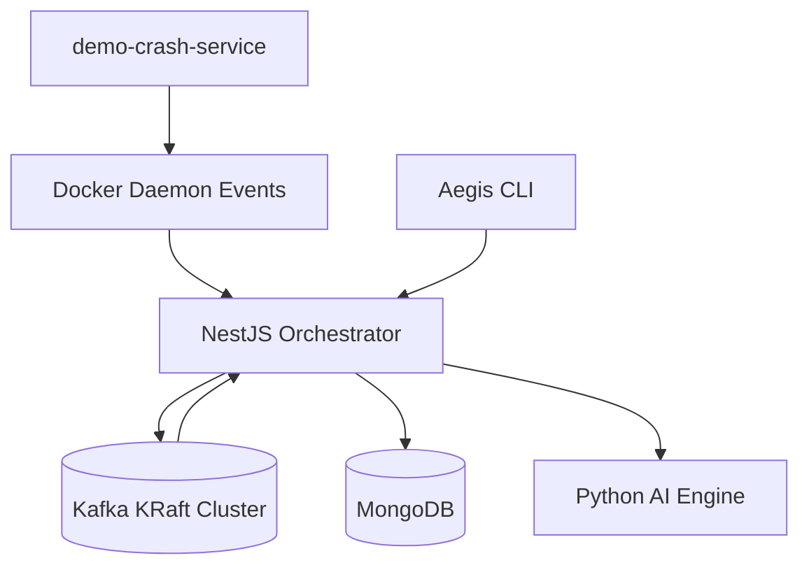
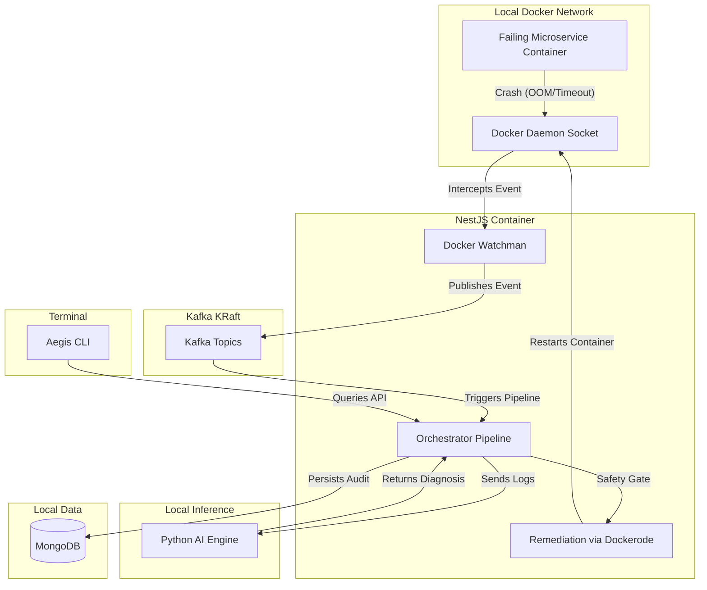

<div align="center">

```
 █████╗ ███████╗ ██████╗ ██╗███████╗
██╔══██╗██╔════╝██╔════╝ ██║██╔════╝
███████║█████╗  ██║  ███╗██║███████╗
██╔══██║██╔══╝  ██║   ██║██║╚════██║
██║  ██║███████╗╚██████╔╝██║███████║
╚═╝  ╚═╝╚══════╝ ╚═════╝ ╚═╝╚══════╝
```

### Air-Gapped AIOps & Self-Healing Infrastructure

*Closed-loop - Local-first - Self-healing*

---

[](https://nestjs.com/)
[](https://kafka.apache.org/)
[](https://www.python.org/)
[](https://www.docker.com/)
[](https://www.mongodb.com/)

</div>

---

## What is Aegis?

> **Aegis** is a closed-loop, local-first SRE platform built around Docker event capture, Kafka streaming, and AI-assisted remediation.

The orchestration stack runs entirely on-prem — no cloud, no telemetry, no external dependencies. The NestJS control plane watches container events, publishes typed Kafka messages, stores audit and incident data in MongoDB, and coordinates deterministic remediation workflows locally. A Python AI engine handles classification and diagnosis offline.

---

## Core Capabilities

| Capability | Description |
|---|---|
| Container Watching | Tracks Docker container lifecycle and crash events in real time |
| Kafka Event Bus | Publishes typed events across incident, log, diagnosis, remediation, and audit topics |
| Health Monitoring | Tracks Kafka producer and consumer health for operator visibility |
| Durable Storage | MongoDB persists plans, services, episodes, and replay history |
| Headless Relay | Structured backend events stay within the control plane and Kafka pipeline |
| AI Engine | Python-based offline training, diagnosis, and classification |
| Chaos Testing | Built-in demo crash service for local simulation |

---

## Architecture



---

## Deep Architecture Flow



---

## Tech Stack

### Backend Orchestrator
- **NestJS 11** + TypeScript
- **KafkaJS** — typed event publishing and consuming
- **Dockerode** — Docker event handling and remediation
- **Mongoose + MongoDB** — durable persistence
- **EventEmitter2** — internal decoupled event bus

### Streaming Layer
- **Kafka** in KRaft mode (no ZooKeeper)
- **Kafka UI** — local topic inspection
- Topics: `aegis.container.events`, `aegis.incident.detected`, `aegis.logs.extracted`, `aegis.ai.diagnosis.completed`, `aegis.remediation.started`, `aegis.remediation.completed`, `aegis.audit.events`, `aegis.rl.feedback`

### Python Services
- `services/ai-engine` — offline inference and model training
- `services/rl-engine` — offline reinforcement learning research
- `services/demo-crash-service` — chaos simulation

### Infrastructure
- **Docker Compose** — single-command full-stack
- **KRaft Kafka** — no external ZooKeeper dependency
- Fully **air-gapped** by design

---

## Local Setup

### Prerequisites

```
Docker Engine and Docker Compose
Node.js  >= 20
Python   >= 3.10
```

### Start the Full Stack

```bash
npm run dev:safe
```
*(This starts the infrastructure, waits for Kafka, and runs NestJS)*

Or manually:
```bash
npm run infra:up
npm run wait:kafka
npm run start:dev
```

> Spins up: MongoDB, Kafka, Kafka UI, NestJS backend, AI engine, Demo crash service

### Debugging

Useful commands if Kafka or other services fail:
```bash
docker compose ps
docker logs aegis-kafka --tail=80
nc -zv localhost 9094
```

---

## Access Points

| Service | URL / Address |
|---|---|
| Backend API | `http://localhost:3001` |
| Swagger Docs | `http://localhost:3001/api/docs` |
| Kafka UI | `http://localhost:8081` |
| MongoDB | `localhost:27018` |
| Kafka Broker | `localhost:9094` |
| AI Engine | `http://localhost:8001` |
| Demo Crash Service | `http://localhost:3000` |

---

## Health Checks

```bash
curl http://localhost:3001/                          # Root liveness
curl http://localhost:3001/api/health                # Health check
curl http://localhost:3001/api/orchestrator/health/kafka  # Kafka health
curl http://localhost:3001/api/orchestrator/containers    # Container list
curl http://localhost:3001/api/orchestrator/incidents     # Incidents
curl http://localhost:3001/api/orchestrator/remediations  # Remediations
curl http://localhost:3001/api/orchestrator/metrics       # Platform metrics
curl http://localhost:8001/health                    # AI engine health
curl http://localhost:3000/health                    # Demo crash service health
```

---

## Chaos Testing

```bash
aegis chaos oom         # OOM crash simulation
aegis chaos timeout     # Timeout hang simulation
aegis chaos crash       # General process crash
aegis chaos permission  # Permission denied simulation
aegis chaos port        # Port collision simulation
```

---

## Kafka Event Flow

```
(1) Docker emits a container event
        |
(2) NestJS Watchman detects and extracts logs
        |
(3) Kafka event published to topic
        |
(4) Orchestrator processes event
        |
(5) AI Engine classifies incident
        |
(6) Safety policy evaluates action
        |
(7) Dockerode executes remediation
        |
(8) MongoDB persists audit record
```

---

## MongoDB Ledger

MongoDB stores the complete audit trail:
- **services** — container status and restart counts
- **infrastructure_events** — raw crash logs and exit codes
- **incident_embeddings** — 384-dimensional log embeddings
- **remediation_plans** — AI diagnosis, risk levels, suggested actions
- **action_executions** — remediation outcomes and duration
- **episodes** — RL training replay buffer
- **metrics_snapshots** — CPU, RAM, disk checkpoints
- **outbox_events** — durable Kafka outbox with retry

---

## AI Engine

The Python AI engine uses:
- **SentenceTransformers** (all-MiniLM-L6-v2) for log embedding
- **MLP classifier** for incident classification
- **FAISS** for similarity search against historical incidents

The engine auto-trains on synthetic data if no pre-trained weights exist.

---

## Safety Policy

```typescript
const safetyPassed =
  !isFallbackDiagnosis &&
  confidenceScore >= 0.85 &&
  riskLevel === 'LOW' &&
  suggestedAction === 'RESTART_CONTAINER';
```

Only low-risk, high-confidence actions are executed automatically. Fallback diagnoses from an unavailable AI engine are never auto-remediated. All other actions are skipped and flagged for operator review.

---

## Security Model

- No shell command execution — all Docker actions use Dockerode API
- Only 3 allowed actions: RESTART_CONTAINER, STOP_CONTAINER, IGNORE
- Confidence and risk gate prevents low-confidence automated actions
- Internal API endpoints protected by `InternalTokenGuard` (token: `x-aegis-token` header)
- No cloud AI APIs — everything is local and offline
- Docker label `aegis.monitor=false` opts containers out of monitoring

---

## Environment Variables

```env
# Infrastructure
MONGODB_URI=mongodb://localhost:27018/aegis
KAFKA_BROKER=localhost:9094
KAFKA_CLIENT_ID=aegis-orchestrator
KAFKA_CONNECTION_RETRIES=15
KAFKA_RESTART_INITIAL_DELAY_MS=1000
KAFKA_RESTART_MAX_DELAY_MS=30000
KAFKA_RESTART_MAX_ATTEMPTS=0

# AI Engine
AI_ENGINE_URL=http://localhost:8001
AI_ENGINE_TIMEOUT_MS=10000

# Demo Service
DEMO_CRASH_SERVICE_URL=http://localhost:3000

# Backend
BACKEND_PORT=3001
NODE_ENV=development

# Monitoring Controls
AEGIS_MAX_RESTARTS_PER_HOUR=5
AEGIS_EXTRA_IGNORED_CONTAINERS=

# Security
AEGIS_INTERNAL_TOKEN=aegis-dev-token

# Docker
DOCKER_SOCKET_PATH=/var/run/docker.sock
```

---

## NPM Scripts

```bash
npm run dev:safe          # Start full stack (infra + backend)
npm run dev               # Start backend in dev mode
npm run build             # Build NestJS backend
npm run build:cli         # Build CLI tool
npm run start:prod        # Start production server
npm run infra:up          # Start Docker infrastructure
npm run infra:down        # Stop Docker infrastructure
npm run wait:kafka        # Wait for Kafka to be ready
npm run verify            # Runtime verification
npm run fix:mongo-port    # Fix MongoDB port conflict
npm run reset:docker      # Full Docker reset and rebuild
npm run lint              # Run ESLint
npm run test              # Run unit tests
npm run typecheck         # TypeScript type checking
npm run format            # Format with Prettier
npm run cli               # Run CLI from dist
```

---

## Makefile Commands

```bash
make help                 # Show all available commands
make build                # Build NestJS backend
make build-cli            # Build CLI tool
make build-all            # Build backend + CLI
make build-docker         # Build all Docker images locally
make lint                 # Run ESLint
make typecheck            # Run TypeScript type checking
make test                 # Run unit tests
make format               # Format code with Prettier
make quality              # Run all quality checks (lint + typecheck + test)
make infra-up             # Start Docker infrastructure
make infra-down           # Stop Docker infrastructure
make infra-restart        # Restart infrastructure
make verify               # Run runtime verification
make dev                  # Start backend in dev mode
make dev-safe             # Start full stack (infra + backend)
make start                # Start production server
make stop                 # Stop all containers
make docker-build-ai      # Build AI Engine Docker image
make docker-build-demo    # Build Demo Crash Service Docker image
make docker-push-ai       # Push AI Engine to registry
make docker-push-demo     # Push Demo Service to registry
make release-tag          # Create a release tag (usage: make release-tag v=1.0.0)
make clean                # Clean build artifacts
```

---

## CLI Reference

### Core Commands

```bash
aegis doctor                  # Infrastructure health check
aegis status                  # Platform snapshot
aegis stream                  # Stream Kafka telemetry to terminal
aegis dashboard               # Live terminal dashboard (5s refresh)
```

### Container Management

```bash
aegis containers list              # List all monitored containers
aegis containers inspect <name>    # Container details + crash history
aegis containers logs <name>       # Recent crash logs
```

### Incident Management

```bash
aegis incidents list               # List recent incidents
aegis incidents inspect <id>       # Full incident detail
```

### Exclusion Management

```bash
aegis exclude list                 # Show exclusion rules
aegis exclude add <name>           # Add to exclusion list
aegis exclude remove <name>        # Remove from exclusion list
```

### Chaos Testing

```bash
aegis chaos oom            # OOM crash simulation
aegis chaos timeout        # Timeout hang simulation
aegis chaos crash          # General process crash
aegis chaos permission     # Permission denied simulation
aegis chaos port           # Port collision simulation
```

### Options

```bash
--debug                    # Enable debug output
```

---

## REST API Endpoints

| Endpoint | Method | Description |
|---|---|---|
| `/` | GET | Root liveness probe |
| `/api/health` | GET | Health check |
| `/api/docs` | GET | Swagger/OpenAPI documentation |
| `/api/orchestrator/health/kafka` | GET | Kafka health status |
| `/api/orchestrator/containers` | GET | List all containers |
| `/api/orchestrator/containers/:id` | GET | Inspect specific container |
| `/api/orchestrator/containers/:id/logs` | GET | Get container crash logs |
| `/api/orchestrator/containers/:id/restart` | POST | Restart container (token protected) |
| `/api/orchestrator/incidents` | GET | List incidents |
| `/api/orchestrator/incidents/:id` | GET | Get incident detail |
| `/api/orchestrator/remediations` | GET | List remediations |
| `/api/orchestrator/remediations/:id` | GET | Get remediation detail |
| `/api/orchestrator/metrics` | GET | Platform metrics |
| `/api/orchestrator/exclusions` | GET | List exclusions |
| `/api/orchestrator/exclusions` | POST | Add exclusion (token protected) |
| `/api/orchestrator/exclusions/:name` | DELETE | Remove exclusion (token protected) |

---

## Troubleshooting

```bash
# Check container status
docker compose ps

# View Kafka logs
docker logs aegis-kafka --tail=80

# Check MongoDB
docker exec aegis-mongodb mongosh --eval "db.adminCommand('ping')"

# Verify Kafka connectivity
nc -zv localhost 9094

# Full runtime verification
npm run verify

# Fix MongoDB port conflict
npm run fix:mongo-port

# Full Docker reset and rebuild
npm run reset:docker

# Remove volumes and rebuild from scratch
docker compose down -v
docker compose up -d --build
```

---

## Demonstration Workflow

1. Start infrastructure: `npm run dev:safe`
2. Verify health: `aegis doctor`
3. View status: `aegis status`
4. Start Kafka stream: `aegis stream`
5. Trigger chaos: `aegis chaos oom`
6. Watch pipeline complete
7. Verify in MongoDB: `curl http://localhost:3001/api/orchestrator/incidents`
8. Verify remediation: `curl http://localhost:3001/api/orchestrator/remediations`

---

## Future Enhancements

- Operator-focused remediation controls and incident review views
- Expanded RL training and policy evaluation workflows
- Additional service integrations for broader observability coverage

---

## Design Principles

> **Local by default.** Kafka, MongoDB, and the backend all run on your own machine.
> No telemetry. No cloud dependency. No surprises.

- Air-gapped — zero external network requirements at runtime
- Closed-loop — detect, diagnose, remediate, learn, all locally
- Auditable — every action persisted in MongoDB for replay and review
- Modular — each service is independently replaceable

---

## Documentation

Additional documentation is available in the `docs/` directory:

- [`docs/architecture.md`](docs/architecture.md) — Detailed architecture overview
- [`docs/ml-pipeline.md`](docs/ml-pipeline.md) — Machine learning pipeline documentation
- [`docs/presentation-flow.md`](docs/presentation-flow.md) — Demo presentation flow
- [`docs/security.md`](docs/security.md) — Security model and policies

---

# 👨‍💻 Developed By

## Tushar Kanti Dey

*Full Stack Developer · DevOps Engineer · AI Infrastructure Enthusiast*

Aegis was developed as a final-year B.Tech Computer Science and Engineering capstone project at **Adamas University**.

[](mailto:t.k.d.dey2033929837@gmail.com)
[](https://github.com/Tusharxhub)
[](https://www.tushardevx01.tech)
[](https://www.instagram.com/tushardevx01/)
