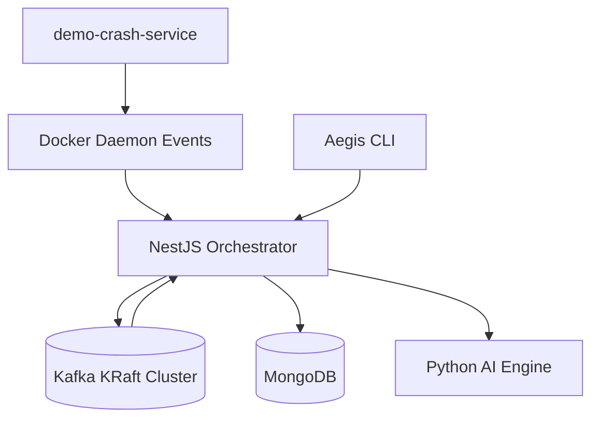
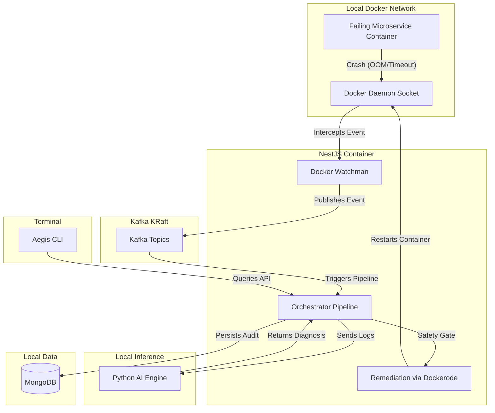

<div align="center">

```
 █████╗ ███████╗ ██████╗ ██╗███████╗
██╔══██╗██╔════╝██╔════╝ ██║██╔════╝
███████║█████╗  ██║  ███╗██║███████╗
██╔══██║██╔══╝  ██║   ██║██║╚════██║
██║  ██║███████╗╚██████╔╝██║███████║
╚═╝  ╚═╝╚══════╝ ╚═════╝ ╚═╝╚══════╝
```

### Air-Gapped AIOps & Self-Healing Infrastructure

*Closed-loop - Local-first - Self-healing*

---

[](https://nestjs.com/)
[](https://kafka.apache.org/)
[](https://www.python.org/)
[](https://www.docker.com/)
[](https://www.mongodb.com/)

</div>

---

## What is Aegis?

> **Aegis** is a closed-loop, local-first SRE platform built around Docker event capture, Kafka streaming, and AI-assisted remediation.

The orchestration stack runs entirely on-prem — no cloud, no telemetry, no external dependencies. The NestJS control plane watches container events, publishes typed Kafka messages, stores audit and incident data in MongoDB, and coordinates deterministic remediation workflows locally. A Python AI engine handles classification and diagnosis offline.

---

## Core Capabilities

| Capability | Description |
|---|---|
| Container Watching | Tracks Docker container lifecycle and crash events in real time |
| Kafka Event Bus | Publishes typed events across incident, log, diagnosis, remediation, and audit topics |
| Health Monitoring | Tracks Kafka producer and consumer health for operator visibility |
| Durable Storage | MongoDB persists plans, services, episodes, and replay history |
| Headless Relay | Structured backend events stay within the control plane and Kafka pipeline |
| AI Engine | Python-based offline training, diagnosis, and classification |
| Chaos Testing | Built-in demo crash service for local simulation |

---

## Architecture



---

## Deep Architecture Flow



---

## Tech Stack

### Backend Orchestrator
- **NestJS 11** + TypeScript
- **KafkaJS** — typed event publishing and consuming
- **Dockerode** — Docker event handling and remediation
- **Mongoose + MongoDB** — durable persistence
- **EventEmitter2** — internal decoupled event bus

### Streaming Layer
- **Kafka** in KRaft mode (no ZooKeeper)
- **Kafka UI** — local topic inspection
- Topics: `container`, `incident`, `logs`, `diagnosis`, `remediation`, `audit`

### Python Services
- `services/ai-engine` — offline inference and model training
- `services/rl-engine` — offline reinforcement learning research
- `services/demo-crash-service` — chaos simulation

### Infrastructure
- **Docker Compose** — single-command full-stack
- **KRaft Kafka** — no external ZooKeeper dependency
- Fully **air-gapped** by design

---

## Local Setup

### Prerequisites

```
Docker Engine and Docker Compose
Node.js  >= 20
Python   >= 3.10
```

### Start the Full Stack

```bash
npm run dev:safe
```
*(This starts the infrastructure, waits for Kafka, and runs NestJS)*

Or manually:
```bash
npm run infra:up
npm run wait:kafka
npm run start:dev
```

> Spins up: MongoDB, Kafka, Kafka UI, NestJS backend, AI engine, Demo crash service

### Debugging

Useful commands if Kafka or other services fail:
```bash
docker compose ps
docker logs aegis-kafka --tail=80
nc -zv localhost 9092
```

---

## Access Points

| Service | URL / Address |
|---|---|
| Backend API | `http://localhost:3001` |
| Kafka UI | `http://localhost:8080` |
| MongoDB | `localhost:27017` |
| Kafka Broker | `localhost:9092` |
| AI Engine | `http://localhost:8000` |
| Demo Crash Service | `http://localhost:3000` |

---

## CLI

```bash
aegis doctor                  # Infrastructure health check
aegis status                  # Platform snapshot
aegis stream                  # Stream Kafka telemetry to terminal
aegis chaos <mode>            # Trigger chaos test
                              # modes: oom | timeout | crash | permission | port
```

---

## Health Checks

```bash
curl http://localhost:3001/api/health
curl http://localhost:3001/api/orchestrator/health/kafka
curl http://localhost:8000/health
```

---

## Chaos Testing

```bash
aegis chaos oom         # OOM crash simulation
aegis chaos timeout     # Timeout hang simulation
aegis chaos crash       # General process crash
aegis chaos permission  # Permission denied simulation
aegis chaos port        # Port collision simulation
```

---

## Kafka Event Flow

```
(1) Docker emits a container event
        |
(2) NestJS Watchman detects and extracts logs
        |
(3) Kafka event published to topic
        |
(4) Orchestrator processes event
        |
(5) AI Engine classifies incident
        |
(6) Safety policy evaluates action
        |
(7) Dockerode executes remediation
        |
(8) MongoDB persists audit record
```

---

## MongoDB Ledger

MongoDB stores the complete audit trail:
- **services** — container status and restart counts
- **infrastructure_events** — raw crash logs and exit codes
- **incident_embeddings** — 384-dimensional log embeddings
- **remediation_plans** — AI diagnosis, risk levels, suggested actions
- **action_executions** — remediation outcomes and duration
- **episodes** — RL training replay buffer

---

## AI Engine

The Python AI engine uses:
- **SentenceTransformers** (all-MiniLM-L6-v2) for log embedding
- **MLP classifier** for incident classification
- **FAISS** for similarity search against historical incidents

The engine auto-trains on synthetic data if no pre-trained weights exist.

---

## Safety Policy

```typescript
const safetyPassed =
  confidenceScore >= 0.85 &&
  riskLevel === 'LOW' &&
  suggestedAction === 'RESTART_CONTAINER';
```

Only low-risk, high-confidence actions are executed automatically. All other actions are skipped and flagged for operator review.

---

## Security Model

- No shell command execution — all Docker actions use Dockerode API
- Only 3 allowed actions: RESTART_CONTAINER, STOP_CONTAINER, IGNORE
- Confidence and risk gate prevents low-confidence automated actions
- Internal API endpoints protected by token-based guards
- No cloud AI APIs — everything is local and offline

---

## Troubleshooting

```bash
# Check container status
docker compose ps

# View Kafka logs
docker logs aegis-kafka --tail=80

# Check MongoDB
docker exec aegis-mongodb mongosh --eval "db.adminCommand('ping')"

# Verify Kafka connectivity
nc -zv localhost 9092

# Full infrastructure reset
node scripts/reset-docker-and-rebuild.js
```

---

## Demonstration Workflow

1. Start infrastructure: `npm run dev:safe`
2. Verify health: `aegis doctor`
3. View status: `aegis status`
4. Start Kafka stream: `aegis stream`
5. Trigger chaos: `aegis chaos oom`
6. Watch pipeline complete
7. Verify in MongoDB: `curl http://localhost:3001/api/orchestrator/incidents`
8. Verify remediation: `curl http://localhost:3001/api/orchestrator/remediations`

---

## Future Enhancements

- Operator-focused remediation controls and incident review views
- Expanded RL training and policy evaluation workflows
- Additional service integrations for broader observability coverage

---

## Design Principles

> **Local by default.** Kafka, MongoDB, and the backend all run on your own machine.
> No telemetry. No cloud dependency. No surprises.

- Air-gapped — zero external network requirements at runtime
- Closed-loop — detect, diagnose, remediate, learn, all locally
- Auditable — every action persisted in MongoDB for replay and review
- Modular — each service is independently replaceable

---

# Developed By

## Tushar Kanti Dey

*Full Stack Developer - DevOps Engineer - AI Infrastructure Enthusiast*

Aegis was developed as a final-year B.Tech Computer Science and Engineering capstone project at **Adamas University**.

[](mailto:t.k.d.dey2033929837@gmail.com)
[](https://github.com/Tusharxhub)
[](https://www.tushardevx01.tech)
[](https://www.instagram.com/tushardevx01/)
