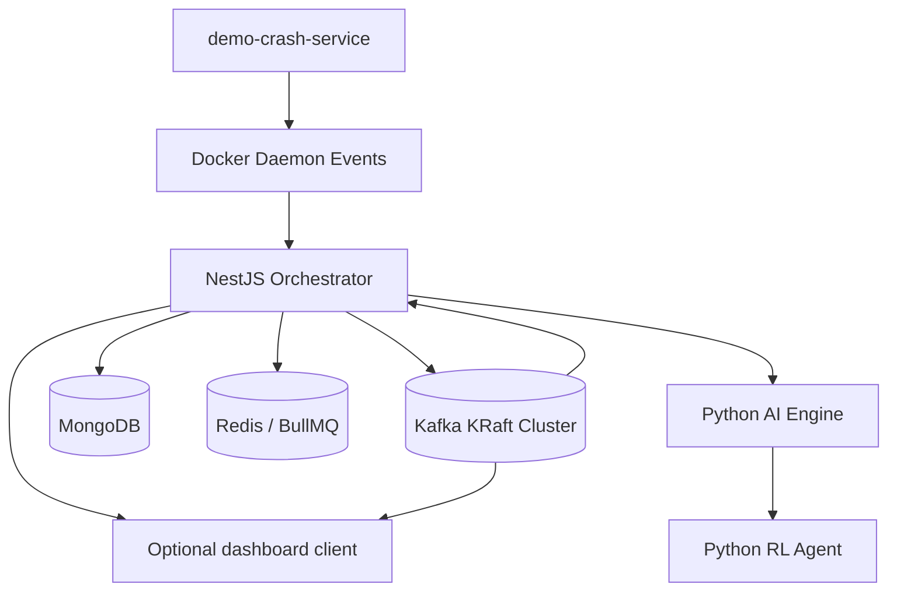
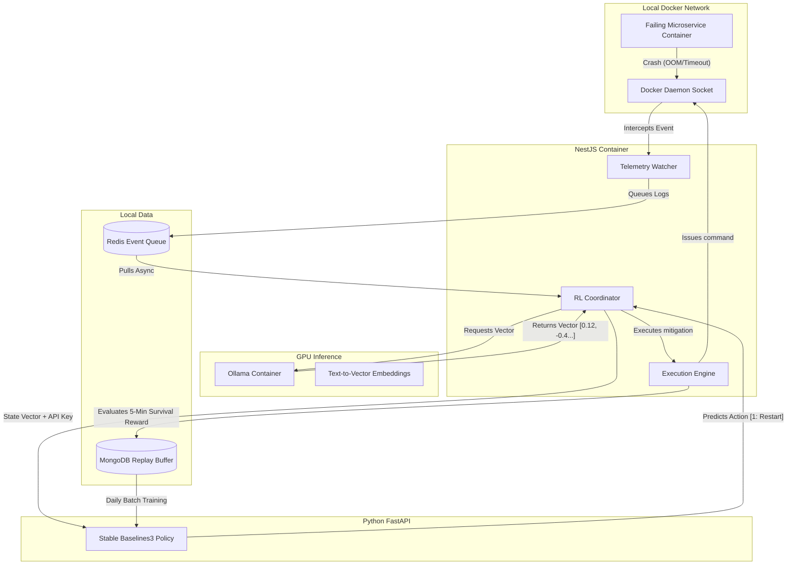

<div align="center">

```
 █████╗ ███████╗ ██████╗ ██╗███████╗
██╔══██╗██╔════╝██╔════╝ ██║██╔════╝
███████║█████╗  ██║  ███╗██║███████╗
██╔══██║██╔══╝  ██║   ██║██║╚════██║
██║  ██║███████╗╚██████╔╝██║███████║
╚═╝  ╚═╝╚══════╝ ╚═════╝ ╚═╝╚══════╝
```

### 🛡️ Air-Gapped AIOps & Reinforcement Learning Infrastructure

*Closed-loop • Local-first • Self-healing*

---

[](https://nestjs.com/)
[](https://kafka.apache.org/)
[](https://www.python.org/)
[](https://www.docker.com/)
[](https://www.mongodb.com/)
[](https://redis.io/)

</div>

---

## ✦ What is Aegis?

> **Aegis** is a closed-loop, local-first SRE platform built around Docker event capture, Kafka streaming, and AI-assisted remediation.

The orchestration stack runs entirely on-prem — no cloud, no telemetry, no external dependencies. The NestJS orchestrator watches container events, publishes typed Kafka messages, stores audit and incident data in MongoDB, and relays normalized updates to connected clients through Socket.io. A Python AI engine and RL agent handle model training and crash-simulation workflows offline.

---

## ⚡ Core Capabilities

| Capability | Description |
|---|---|
| 🐳 **Container Watching** | Tracks Docker container lifecycle and crash events in real time |
| 📡 **Kafka Event Bus** | Publishes typed events across incident, log, diagnosis, remediation, and audit topics |
| 🩺 **Health Monitoring** | Tracks Kafka producer and consumer health for operator visibility |
| 🗄️ **Durable Storage** | MongoDB persists plans, services, episodes, and replay history |
| ⚙️ **Async Queuing** | Redis and BullMQ handle background work and async processing |
| 🔌 **Live Gateway** | Socket.io broadcasts normalized system events to connected clients |
| 🤖 **AI Engine** | Python-based offline training, diagnosis, and RL policy workflows |
| 💥 **Chaos Testing** | Built-in demo crash service for local simulation |

---

## 🏛️ Architecture



---

## 🔬 Deep Architecture Flow



---

## 🧱 Tech Stack

<table>
<tr>
<td valign="top" width="50%">

### 🟥 Backend Orchestrator
- **NestJS 11** + TypeScript
- **KafkaJS** — typed event publishing & consuming
- **Socket.io** — realtime event relay gateway
- **Dockerode** — Docker event handling
- **BullMQ + Redis** — async queueing
- **Mongoose + MongoDB** — durable persistence

</td>
<td valign="top" width="50%">

### 🟧 Streaming Layer
- **Kafka** in KRaft mode *(no ZooKeeper)*
- **Kafka UI** — local topic inspection
- Topics: `container` · `incident` · `logs` · `diagnosis` · `remediation` · `metrics` · `audit`

</td>
</tr>
<tr>
<td valign="top" width="50%">

### 🟦 Python Services
- `services/ai-engine` — model training & inference
- `rl-agent` — reinforcement-learning control loop
- `demo-crash-service` — chaos simulation

</td>
<td valign="top" width="50%">

### 🟩 Infrastructure
- **Docker Compose** — single-command full-stack
- **KRaft Kafka** — no external ZooKeeper dependency
- Fully **air-gapped** by design

</td>
</tr>
</table>

---

## 🚀 Local Setup

### Prerequisites

```
Docker Engine & Docker Compose
Node.js  ≥ 20
Python   ≥ 3.10
```

### Start the Full Stack

```bash
docker compose up --build -d
```

> Spins up: MongoDB · Redis · Kafka · Kafka UI · NestJS backend · AI engine · Demo crash service

### Development Mode

```bash
cd backend && npm run start:dev
```

> Runs the NestJS orchestrator locally while keeping all supporting services in Docker.

---

## 🌐 Access Points

| Service | URL / Address |
|---|---|
| 🖥️ Backend API + Socket.io | `http://localhost:3001` |
| 📊 Kafka UI | `http://localhost:8080` |
| 🗄️ MongoDB | `localhost:27017` |
| ⚡ Redis | `localhost:6379` |
| 📨 Kafka Broker | `localhost:9092` |
| 🤖 AI Engine | `http://localhost:8000` |
| 💥 Demo Crash Service | `http://localhost:3002` |

---

## 🔄 Kafka Event Flow

```
① Docker emits a container event
        ↓
② NestJS normalizes & publishes to Kafka
        ↓
③ Kafka consumers validate & classify the stream
        ↓
④ Dashboard relay broadcasts via Socket.io
        ↓
⑤ MongoDB persists history & audit trail
```

---

## 🔭 Under Development

- [ ] 🖥️ Browser dashboard for live Kafka event visualization
- [ ] 🛠️ Operator-focused remediation controls & incident review views
- [ ] 🧠 Expanded RL training & policy evaluation workflows
- [ ] 🔗 Additional service integrations for broader observability coverage

---

## 📌 Design Principles

> **Local by default.** Kafka, Redis, MongoDB, and the backend all run on your own machine.
> No telemetry. No cloud dependency. No surprises.

- 🔒 Air-gapped — zero external network requirements at runtime
- 🔁 Closed-loop — detect → diagnose → remediate → learn, all locally
- 📜 Auditable — every action persisted in MongoDB for replay and review
- 🧩 Modular — each service is independently replaceable

---

## 👨‍💻 Developed By

<div align="center">

### Tushar Kanti Dey
*Full Stack Developer · DevOps Engineer · AI Infrastructure Enthusiast*

---

*Aegis was developed as a capstone project for the*
*Bachelor of Technology (B.Tech) in Computer Science & Engineering*
*at **Adamas University***

---

*Engineered to explore the convergence of autonomous infrastructure orchestration,*
*real-time observability, and localized AI systems — demonstrating how modern*
*DevOps environments can evolve from passive monitoring into intelligent,*
*self-healing platforms capable of deterministic recovery and autonomous*
*operational decision-making.*

---

[](mailto:t.k.d.dey2033929837@gmail.com)
[](https://github.com/Tusharxhub)
[](https://www.tushardevx01.tech)
[](https://www.instagram.com/tushardevx01/)

</div>

---

<div align="center">

*Built with precision. Deployed locally. Evolving autonomously.*

**⭐ Star this repo if Aegis inspires your infrastructure thinking**

</div>