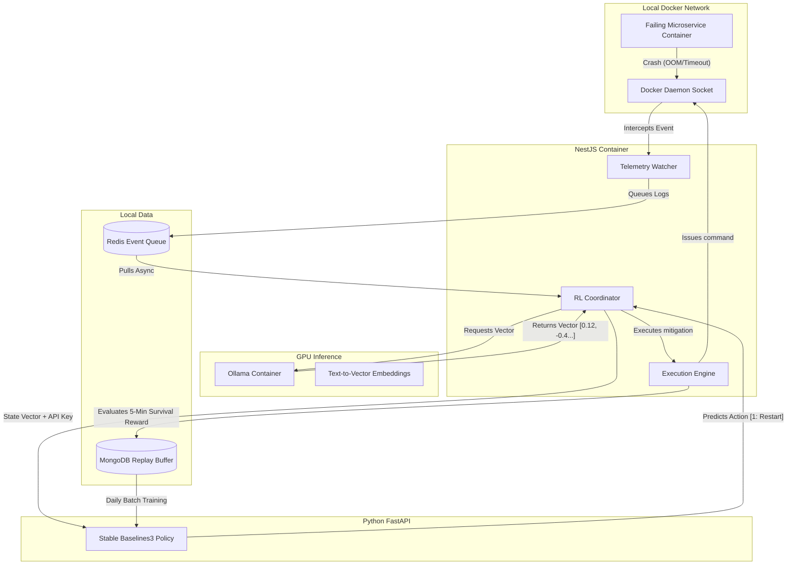

# Aegis 🛡️
### Air-Gapped AIOps & Reinforcement Learning Infrastructure

[](https://nextjs.org/)
[](https://nestjs.com/)
[](https://www.python.org/)
[](https://www.docker.com/)
[](https://www.mongodb.com/)
[](https://ollama.com/)

Aegis is a closed-loop, autonomous Site Reliability Engineering (SRE) platform. Unlike standard observability tools that rely on static thresholds or external LLM APIs, Aegis operates a **Reinforcement Learning (RL) Brain** directly on your local hardware. 

By actively monitoring Docker microservices, vectorizing crash logs using local GPUs, and computing optimal recovery actions through a continuously trained neural network, Aegis learns how to heal your infrastructure through trial and error.

**100% Air-Gapped.** No external APIs. No cloud databases. Zero data leakage. 

---

## 🔥 Key Innovations

* **Reinforcement Learning (AIOps):** Powered by Python and Stable Baselines3, the infrastructure learns from its own execution history.
* **On-Device Vectorization:** Utilizes Ollama with NVIDIA GPU passthrough to embed raw, chaotic error logs into dense mathematical vectors for the neural network.
* **Closed-Loop Autonomy:** Detects crashes, predicts mitigation actions, executes Docker commands natively, and evaluates the survival reward all within milliseconds.
* **Cinematic Observability:** A high-performance, dark-mode Next.js dashboard featuring deep glassmorphism and real-time WebSocket telemetry for tracking the RL training loops.
* **Air-Gapped Security:** A strict API Key handshake secures the Python ML microservice, preventing unauthorized execution.

---

## 🧠 The Reinforcement Learning Loop (MDP)

Aegis maps DevOps incident response into a strict Markov Decision Process:

1. **State ($S_t$):** The NestJS orchestrator extracts the last 100 lines of crash logs from a dead container. Ollama converts these logs into a dense vector embedding, combined with metric flags (e.g., OOM kill status, CPU spikes).
2. **Action ($A_t$):** The Python RL Agent evaluates the state vector and predicts a discrete action: `[0: Do Nothing, 1: Restart, 2: Rollback, 3: Scale Up]`.
3. **Execution:** NestJS executes the chosen action via the UNIX Docker socket (`/var/run/docker.sock`).
4. **Reward ($R_t$):** NestJS initiates a 5-minute evaluation window. 
   * **+10 Reward:** If the container remains healthy.
   * **-15 Penalty:** If the container crashes again.
5. **Memory (Replay Buffer):** The entire Episode `(State, Action, Reward, NextState)` is committed to the local MongoDB instance. The Python agent pulls these records daily to update its model weights (`model.learn()`).

---

## 🏗️ Deep Architecture Flow



---

## ⚙️ Technology Stack

**The Neural Engine (Python)**

* Python 3.10 & FastAPI
* Stable Baselines3 (PPO/DQN) & PyTorch
* Uvicorn (Secured via `X-Aegis-Auth-Token`)

**The Orchestrator (NestJS)**

* NestJS & TypeScript
* Dockerode (Direct daemon manipulation)
* BullMQ & Redis (Asynchronous queueing)
* Mongoose (MongoDB ODM)
* Socket.io Gateway

**Data & Edge Compute**

* MongoDB (Episode & Replay Buffer Storage)
* Redis (Event Streaming)
* Ollama (Local AI Runtime for Embeddings)

**The Control Center (Next.js)**

* Next.js 14 (App Router) & TypeScript
* Tailwind CSS & Framer Motion (Glassmorphic UI)
* Recharts (Reward & Training visualizers)

---

## 📦 Installation & Deployment

### Hardware & Software Prerequisites

* **CPU:** Ryzen 7 / Intel i7+
* **RAM:** 16GB Minimum
* **GPU:** NVIDIA RTX Series (with NVIDIA Container Toolkit installed)
* **OS:** Linux (Ubuntu/Fedora) natively or WSL2
* **Tools:** Docker Engine, Docker Compose

### Step 1: Ignite the Infrastructure

Clone the repository and boot the completely localized Docker network.

```bash
git clone [https://github.com/Tusharxhub/aegis.git](https://github.com/Tusharxhub/aegis.git)
cd aegis
docker-compose up -d

```

*This spins up MongoDB, Redis, the Python RL Agent, and the Ollama GPU container.*

### Step 2: Configure Internal Security

Create a `.env` file in the root directory to share the API Key across containers:

```env
AEGIS_INTERNAL_KEY="generate_a_secure_random_string_here"
MONGO_URI="mongodb://aegis-mongo:27017/aegis"
REDIS_URL="redis://aegis-redis:6379"

```

### Step 3: Pull the Embedding Model

```bash
docker exec -it aegis-ollama ollama pull nomic-embed-text

```

### Step 4: Boot the Control & Orchestration Planes

```bash
# Terminal 1: Boot NestJS Orchestrator
cd backend && npm run start:dev

# Terminal 2: Boot Next.js Control Center
cd frontend && npm run dev

```

---

## 💥 Live Chaos Simulation

To test Aegis's autonomous self-healing loops, you can trigger specific microservice failures inside the running cluster. The `demo-crash-service` container exposes three endpoints on host port `3002` simulating realistic DevOps crashes:

1. **Simulate Out-Of-Memory (OOM) Kill**
   ```bash
   curl http://localhost:3002/crash/oom
   ```
   *Effect: Rapidly allocates memory arrays in a loop until Node.js crashes with a heap limit allocation failure. Aegis classifies the crash, verifies the `LOW` risk profile, and automatically restarts the container.*

2. **Simulate Database Timeout / Connection Lock**
   ```bash
   curl http://localhost:3002/crash/timeout
   ```
   *Effect: Simulates an unrecoverable database connection lock and exits with a DB_TIMEOUT trace. Aegis catches the failure, validates it, and issues a restart.*

3. **Simulate Port Binding Conflict on Startup**
   ```bash
   curl http://localhost:3002/crash/port
   ```
   *Effect: Attempts to bind an already-used port, causing an immediate fatal EADDRINUSE startup error. Because port conflicts cannot be healed by simple restarts, Aegis flags this as a `HIGH` risk plan, stops the container, and marks the service status as `DEGRADED` for manual operator oversight.*

When triggered, the NestJS Orchestrator will intercept the Docker Daemon events, extract the stack traces, pass them to the AI Engine for vectorization, and execute the correct remediation sequence.

---

```
## 👨‍💻 Developed By

### **Tushar Kanti Dey**  
*Full Stack Developer • DevOps Engineer • AI Infrastructure Enthusiast*

Aegis was developed as a capstone project for the Bachelor of Technology (B.Tech) program in Computer Science & Engineering at Adamas University.

The project was engineered to explore the convergence of autonomous infrastructure orchestration, real-time observability, and localized artificial intelligence systems. Its primary objective is to demonstrate how modern DevOps environments can evolve from passive monitoring systems into intelligent self-healing platforms capable of deterministic recovery and autonomous operational decision-making.

---

### Connect

- 📧 Email: t.k.d.dey2033929837@gmail.com
- 🔗 GitHub: https://github.com/Tusharxhub
- 🌐 Portfolio: https://www.tushardevx01.tech
- 📸 Instagram: https://www.instagram.com/tushardevx01/
```
