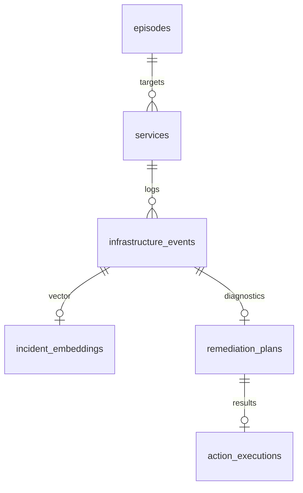

# Project Aegis 🛡️ — System Architecture Specification

This document details the distributed systems topology, event queuing flows, and database interactions of the Aegis platform.

---

## 🏗️ High-Level Topology

Aegis is constructed of three primary services coordinated over a private localized Docker network bridge (`aegis-network`):

```
                                      [ aegis-network ]
                                              │
    [ Next.js UI ] <══ WebSocket ══> [ NestJS Orchestrator ] ── UNIX socket ──> [ host docker.sock ]
                                              │
                                        (HTTP JSON)
                                              │
                                              ▼
                                     [ Python AI Engine ]
```

---

## 📡 The SRE Orchestrator (NestJS)

The orchestrator is built in NestJS, utilizing its dependency injection container to coordinate five core system modules:

### 1. Watchman (Docker Socket Watcher)
- **Engine**: Connected to the host machine's `/var/run/docker.sock` UNIX domain socket using `dockerode`.
- **Logic**: Subscribes to the daemon's raw event stream. It filters specifically for `container` resource events with the action `die`.
- **Logs Pull**: Upon intercepting a crash, it initiates a stdout/stderr tail command requesting the last 100 lines of multiplexed container log buffers.

### 2. Task Queue (BullMQ & Redis)
- **Engine**: Redis-backed BullMQ queue provider.
- **Reasoning**: Decouples the low-latency socket watcher from the high-overhead AI classification API.
- **Persistence**: BullMQ tasks are persisted inside the `aegis-redis` container, preventing transaction loss if the NestJS container crashes during remediation.

### 3. AI Client Coordinator
- **Logic**: Destructures BullMQ job payloads, compiles raw error text, and makes a POST call to `http://aegis-ai-engine:8000/diagnose`.
- **Contracts**: Validates the output against a strict schema. It logs the returned SentenceTransformer vector embedding array to MongoDB.

### 4. Safe Remediation Engine
- **Strict Actions**: The AI never generates or runs raw terminal shell scripts. It returns an action enum (`RESTART_CONTAINER` or `STOP_CONTAINER`).
- **Safety Gate Check**:
  - Checks if `confidenceScore > 0.85`.
  - Checks if `riskLevel == LOW` (Only `RESTART_CONTAINER` is allowed for automatic execution. High-risk actions like `STOP_CONTAINER` are flagged for human operator oversight).
- **Execution**: Invokes native Docker APIs via `dockerode` to halt or restart the target resources.

### 5. Realtime WS Gateway
- **Engine**: Socket.io server running on port 3001.
- **Events**:
  - `incident.detected`: Emitted on container crash.
  - `ai.analysis.completed`: Emitted after model classification.
  - `remediation.completed`: Emitted after execution, carrying duration metrics.

---

## 🗄️ Unified Local Database Store (MongoDB)

A single local MongoDB instance stores the audit trail, log embeddings, remediation plans, and Reinforcement Learning episode buffers. All operations are interfaced via Mongoose in NestJS and PyMongo in the AI Engine.



- **services**: Tracks monitored targets, status enums (`HEALTHY`, `CRASHED`), and cumulative restart counts.
- **infrastructure_events**: Stores the raw crash log text blocks, exit codes, and timestamps.
- **incident_embeddings**: Stores the 384-dimensional floating point representation of the logs (`Float[]` array).
- **remediation_plans**: Stores the neural net diagnosis outputs, risk level labels, and suggested actions.
- **action_executions**: Audits execution logs, outcomes, and task duration metrics.
- **episodes**: Replay buffer storing the Markov Decision Process `(State, Action, Reward, NextState)` tuples for Reinforcement Learning training.
