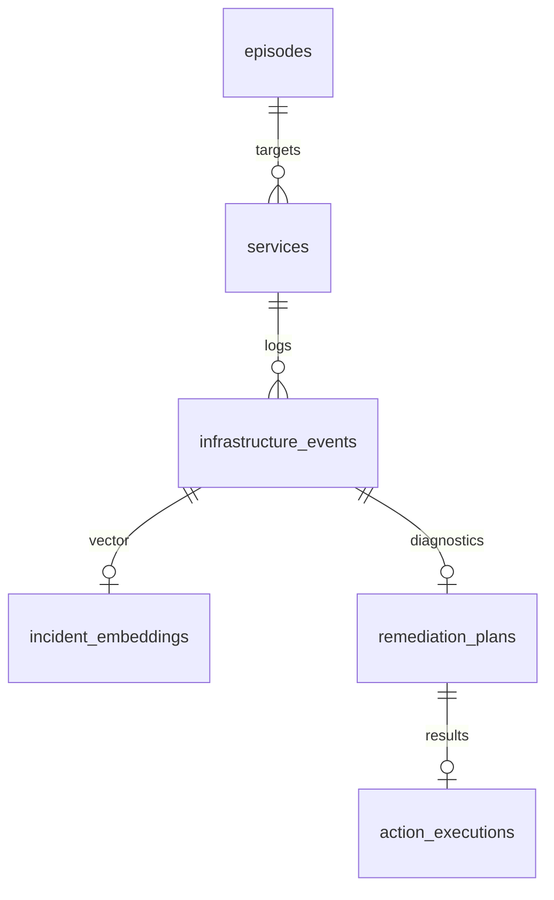

# Project Aegis — System Architecture Specification

This document details the distributed systems topology, event flows, and database interactions of the Aegis platform.

---

## High-Level Topology

Aegis is constructed of three primary services coordinated over a private localized Docker network bridge (`aegis-network`):

```
                                      [ aegis-network ]
                                              |
                                      [ NestJS Orchestrator ] -- UNIX socket --> [ host docker.sock ]
                                              |
                                        (HTTP JSON)
                                              |
                                              v
                                     [ Python AI Engine ]
```

---

## The SRE Orchestrator (NestJS)

The orchestrator is built in NestJS, utilizing its dependency injection container to coordinate core system modules:

### 1. Docker Watchman (Container Event Watcher)
- **Engine**: Connected to the host machine's `/var/run/docker.sock` UNIX domain socket using `dockerode`.
- **Logic**: Subscribes to the daemon's raw event stream. It filters specifically for `container` resource events with the action `die`.
- **Logs Pull**: Upon intercepting a crash, it initiates a stdout/stderr tail command requesting the last 100 lines of multiplexed container log buffers.

### 2. Kafka Event Backbone
- **Engine**: KafkaJS producer and consumers running against a local KRaft-mode Kafka cluster.
- **Reasoning**: Decouples the low-latency socket watcher from the high-overhead AI classification API. Provides durable event streaming and audit trail.
- **Persistence**: All events are persisted in Kafka topics and MongoDB.

### 3. AI Client Coordinator
- **Logic**: Compiles raw error text and makes a POST call to `http://aegis-ai-engine:8000/diagnose`.
- **Contracts**: Validates the output against a strict schema. It logs the returned SentenceTransformer vector embedding array to MongoDB.

### 4. Safe Remediation Engine
- **Strict Actions**: The AI never generates or runs raw terminal shell scripts. It returns an action enum (`RESTART_CONTAINER`, `STOP_CONTAINER`, or `IGNORE`).
- **Safety Gate Check**:
  - Checks if `confidenceScore >= 0.85`.
  - Checks if `riskLevel == LOW` (Only low-risk actions are allowed for automatic execution. High-risk actions like `STOP_CONTAINER` are flagged for human operator oversight).
- **Execution**: Invokes native Docker APIs via `dockerode` to halt or restart the target resources.

---

## Unified Local Database Store (MongoDB)

A single local MongoDB instance stores the audit trail, log embeddings, remediation plans, and Reinforcement Learning episode buffers. All operations are interfaced via Mongoose in NestJS and PyMongo in the AI Engine.



- **services**: Tracks monitored targets, status enums (`HEALTHY`, `CRASHED`), and cumulative restart counts.
- **infrastructure_events**: Stores the raw crash log text blocks, exit codes, and timestamps.
- **incident_embeddings**: Stores the 384-dimensional floating point representation of the logs (`Float[]` array).
- **remediation_plans**: Stores the neural net diagnosis outputs, risk level labels, and suggested actions.
- **action_executions**: Audits execution logs, outcomes, and task duration metrics.
- **episodes**: Replay buffer storing the Markov Decision Process `(State, Action, Reward, NextState)` tuples for offline Reinforcement Learning training.

---

## Kafka Topics

| Topic | Purpose |
|---|---|
| `aegis.container.events` | Docker container lifecycle events |
| `aegis.incident.detected` | Crash incidents logged by orchestrator |
| `aegis.logs.extracted` | Extracted container logs |
| `aegis.ai.diagnosis.completed` | AI engine diagnosis results |
| `aegis.remediation.started` | Remediation execution started |
| `aegis.remediation.completed` | Remediation execution completed |
| `aegis.audit.events` | Audit trail events |

---

## Safety Policy

The orchestrator enforces a deterministic safety policy before executing any remediation:

```typescript
const safetyPassed =
  confidenceScore >= 0.85 &&
  riskLevel === 'LOW' &&
  suggestedAction !== 'IGNORE';
```

Only actions meeting all three criteria are executed automatically. All other actions are marked as `SKIPPED` and flagged for operator review.

---

## Offline RL Engine

The RL engine (`services/rl-engine`) operates strictly offline:

```
MongoDB historical incidents
        |
Replay dataset generation
        |
Offline RL training and evaluation
        |
Research metrics and candidate policies
```

It must never restart containers, stop containers, access the Docker socket, or bypass the NestJS safety policy engine.
